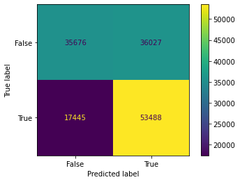

# Overview 

This project is focused on creating an accurate recommendation system for Apple Music. In my dataset, I analyzed over 470,000 different songs that included descriptive features like tempo, loundness, genre, etc. I ran many different models and narrowed it down to an XGBoost model. My goal is to make a music recommendation system that can find 20 songs that are similar to the song plugged into the function.

# Business Problem

I have been hired by Apple Music to help improve their recommendation system and keep users engaged on their streaming service. Spotify, a competitor streaming service, has the best experience for the user when it comes to recommending songs and making playlists. Spotify leads the streaming platforms with over 400 million users and over 150 million premium subscirbers. Apple Music is at 88 million subscribers. With an improved recommendation system, I believe Apple Music can start to close the gap with Spotify.

# Data Understanding 

I got my dataset from Kaggle which is based off real data from Spotify. The dataset had around 600,000 songs with 15 descriptive features. The descriptive features of the song include elements like duration, loudness, key, popularity, and tempo. Before I made the recommendation system, I wanted to make a model that could predict the populairty of a song. Popularity is metric calculated by Spotify and it is based off the number of streams a song has. What this will allow me to do is learn a user's preference by first recommending popular songs from all types of genres and see what songs the user will skip or listen to. 

# Methods 

Before the modeling phase, I had to make sure my data was clean. There were null values in genres, artist names, and track names that accounted for only 5% of the data frame. I dropped all null values, but there was still cleaning to be done. The track IDs and artist IDs were in lists and strings. I stripped off the brackets and removed the quotation marks and got the IDs into objects. 

Next step was deciding what my target should be. I decided my target should be track_popularity because it would be easy to predict on and it is already calculated by Spotify. I set my target variable to be popular songs that are ranked 30 or higher because those tracks make up around 45% of my data frame.

During the modeling phase, I focused on limiting false positives. I want to establish what a true positive, true negative, false positive, and false negative are in this business understanding. 

True positive: My model correctly predicts a song is popular. 

True negative: My model correctly predicts a song is not popular. 

False positive: My model predicts a song is popular when it is not. 

False negative: My model predicts a song is not popular when it is. 

I want to reduce false positives when a user is being recommended songs because I want to make sure they are listening to popular songs and stay engaged on Apple Music. I focused on improving my model's F1 score to limit false positives. 

I tried several different models and went with my best model which was an XGBoost. The XGBoost model had more true positives and a lower false positive rate than the other models and had the highest F1 score. I ran a grid search to find the best parameters to get the highest F1 score for my model. 

# Results 

Our model posted a Train F1 and Test F1 of .66 and a precision of .60. Having a higher F1 score means that there will be less false positives in our predictions. Although my model does not excel in accuracy, which is .62 on both the train and test sets, it does a good job of minimizing false positives and recommending popular songs to keep users engaged on Apple Music.

# Conclusions

- I was able to make a model that can predict whether a song is popular or not with 62% accuracy and reduce the overfitting on my training data. 
- I was able to increase my true positives by nearly 7,000 songs. 
- We will miss out on 12% of songs that are actually positive. 

# Future Analysis 

For future work, I will work on improving the accuracy score and decreasing the number of false negatives so that the recommendation system does not miss out on popular songs. 